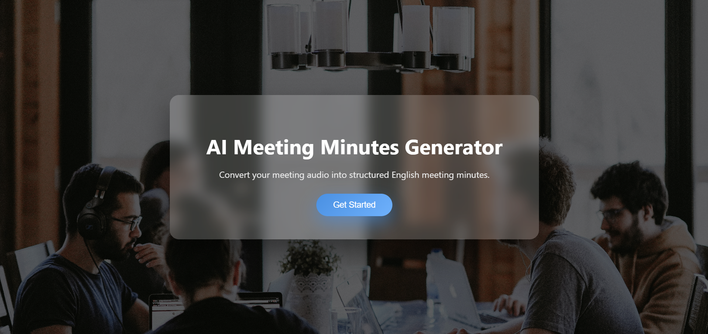
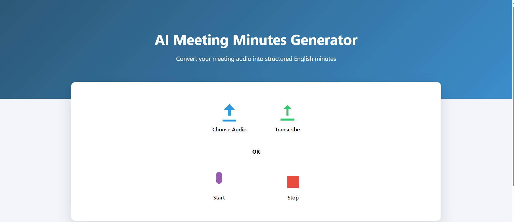
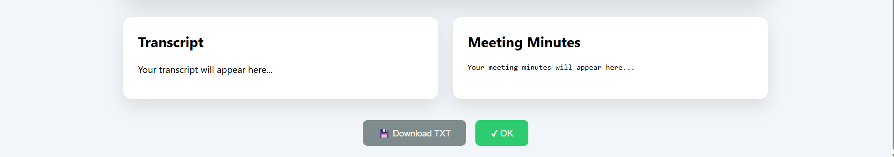

# AI Meeting Minutes Generator

## Overview
The AI Meeting Minutes Generator is a web-based application that converts meeting audio into well-structured meeting minutes using OpenAI Whisper speech recognition. It helps users automatically generate accurate meeting notes, saving time and improving productivity.

## Features
- Upload meeting audio files
- Automatic speech-to-text conversion using Whisper
- Generates structured meeting minutes
- Simple and user-friendly interface
- Built with Flask and Python

## Technologies Used
- Python
- Flask
- OpenAI Whisper
- HTML
- CSS
- FFmpeg

## Project Structure

```
AI-Meeting-Minutes-Generator/
│── app.py
│── templates/
│   ├── index.html
│   ├── welcome.html
│   ├── thankyou.html
│   └── static/
│       ├── style.css
│       └── meeting.jpg
│── .gitignore
```

## Installation

1. Clone the repository

```bash
git clone https://github.com/raks-90/AI-Meeting-Minutes-Generator.git
```

2. Go to the project folder

```bash
cd AI-Meeting-Minutes-Generator
```

3. Install the required packages

```bash
pip install -r requirements.txt
```

4. Run the application

```bash
python app.py
```

5. Open your browser and visit

```
http://127.0.0.1:5000
```

## Future Enhancements

- Support multiple audio formats
- Speaker identification
- Export meeting minutes as PDF
- Cloud deployment
- Multi-language transcription
  ## Screenshots

### Welcome Page



### Upload Audio



### Generated Meeting Minutes



## Author

**Rakshita P Naik**

GitHub: https://github.com/raks-90
